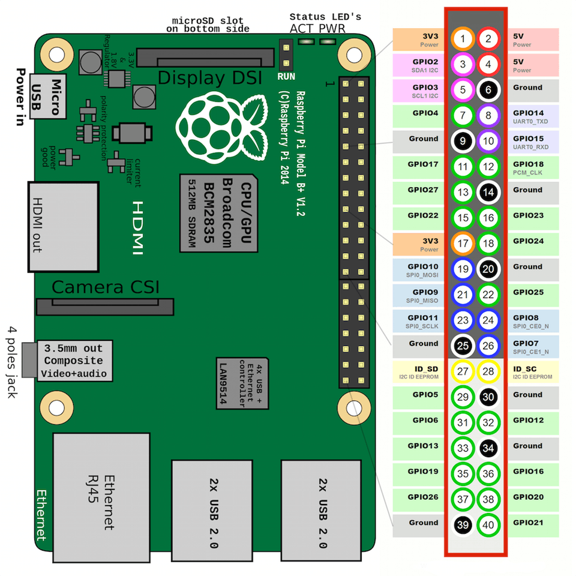
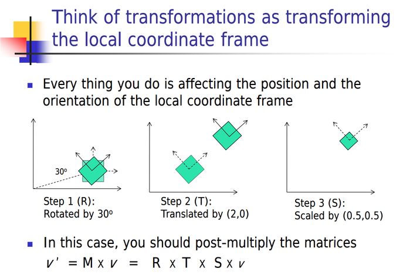

# Spot Micro Project Notes

* [Raspberry Pi Raspbian Installation Notes](#raspberry-pi-raspbian-installation-notes)
* [Raspberry Pi Ubuntu Notes](#raspberry-pi-ubuntu-notes)
* [Raspberry Pi GPIO Diagram](#raspberry-pi-gpio-diagram)
* [Useful ROS Commands](#useful-ros-commands)
* [Debugging in VSCode](#debugging-in-vscode)
* [Rotation Matrices](#rotation-matrices)
* [Catkin Stuff](#catkin-stuff)

## Raspberry Pi Raspbian Installation Notes
Following instructions on http://wiki.ros.org/ROSberryPi/Installing%20ROS%20Kinetic%20on%20the%20Raspberry%20Pi

* Set IP Address as static: 192.168.1.80
* Run update: `sudo apt-get update`
* Install Samba `sudo apt-get install samba`
    * File server, to allow sharing directory accross network. 
    * Share Catkin workspace source folder, edit /etc/samba/smb.conf and at the bottom add the following:
        ```
        [catkin_ws_src]
        comment = Samba on pi
        path = /home/pi/ros_catkin_ws/src/
        read only = no
        browsable = yes
        ```
    * Connect in ubuntu by opening file manager, find `Connect to Server` and enter: `smb://192.168.1.80/catkin_ws_src`
    * Consider replacing with other file share in the future
* Install libi2c libraries: `sudo apt-get install libi2c-dev`
* Clone i2c ROS Librarty from gitlab into ros catkin workspace src directory (https://gitlab.com/bradanlane/ros-i2cpwmboard):   
    ```
    cd ~/ros_catkin_ws/src
    git clone https://gitlab.com/bradanlane/ros-i2cpwmboard.git
    ```
* Cd back to ros_catkin_ws and run `catkin_make`, or if that doesnt work, run `catkin_make_isolated`
    * May need to change group and owner of build_isolated and other directories in ros_catkin_ws, do so via:
        ```
        sudo chown -R pi build_isolated
        sudo chgrp -R pi build_isolated
        ```
* Problem with i2c durign compilation... trying premade ubuntu image instead

## Raspberry Pi Ubuntu Notes
* Using prebuilt image from https://downloads.ubiquityrobotics.com/
* Changed hostname to UbuntuRosPi
* Password is 1234
* Run update: `sudo apt-get update`
* Install Samba `sudo apt-get install samba`
* File server, to allow sharing directory accross network. 
    * Share Catkin workspace source folder, edit /etc/samba/smb.conf and at the bottom add the following:
        ```
        [catkin_ws_src]
            comment = Samba on ubuntu
            path = /home/ubuntu/catkin_ws/src/
            read only = no
        browsable = yes
        ```
    * Connect in ubuntu by opening file manager, find `Connect to Server` and enter: `smb://ubunturospi.local/catkin_ws_src`
    * Consider replacing with other file share in the future
* Install libi2c-dev via `sudo apt install libi2c-dev`
* cd to catkin src directory, clone ros i2c library (from https://gitlab.com/bradanlane/ros-i2cpwmboard/-/tree/master), and run catkin_make
    ```
    cd ~/catkin_ws/src
    git clone https://gitlab.com/bradanlane/ros-i2cpwmboard.git
    cd ..
    catkin_make
    ```
* cd to catkin_ws/ros-i2cpwmboard/launch, and edit i2cpwm_node.launch
    * Remove launch prefix section "sudo -E"
* Connect PCA9685 and run ros i2c node via `rosrun i2cpwm_board i2cpwm_board`

* Add wifi with `sudo pifi add MyNetwork password`


## Raspberry Pi GPIO Diagram



## Useful ROS Commands
* See ros topic list: `rostopic list`
* See info about topic: `rostopic info /<topic_name>`, e.g.: `rostopic info /servos_absolute`
* Show structure of message: `rosmsg show i2cpwm_board/ServoArray`

## Debugging in VSCode
* Create launch.json file in .vscode directory with 
```
{
    "version": "0.2.0",
    "configurations": [
        {
            "name": "ROS: Attach",
            "type": "ros",
            "request": "attach"
        }
    ],
    "compounds": []
}
```
* Build executables with debug option via catkin_make: `catkin_make -DCMAKE_BUILD_TYPE=Debug`
* Attach ros to desired process, breakpoint should work
* See this github page for more info: https://github.com/ms-iot/vscode-ros/blob/master/doc/debug-support.md#launch

## Rotation Matrices
Order of rotation matrices determine how a rotation is done.

For example, consider the rotation matrix:
`R = R_x * R_y * R_z`
Where R_x is a rotation about the x axis, and so forth. The matrix R can be 
thought of as doing one of the following:
1. A rotation in the order x, y, and then z, about the local axes of an object
2. A rotation in the order z, y, x in the global, fixed, coordinate system.

In the case of the first operation, the columns of R represent the basis of the locally rotated coordinate system expressed in the global fixed coordinate system.

The following two diagrams provide an equivalent explanation:




Images from here: http://web.cse.ohio-state.edu/~wang.3602/courses/cse5542-2013-spring/6-Transformation_II.pdf

## Catkin Stuff
Convert catkin workspace to catkin_tools, delete build/devel/install directories (everything other than src) and run catkin build. Extend base /opt/ros/kinetic build environment.

Enable export of compiler build flags for youcomplete me in vim (catkin config -DCMAKE_EXPORT_COMPILE_COMMANDS=ON)

Add .ycm_extra_conf.py file to catkin_ws directory

Install rospkg via pip3 (sudo pip3 install -U rospkg). May need to first install python3-pip

